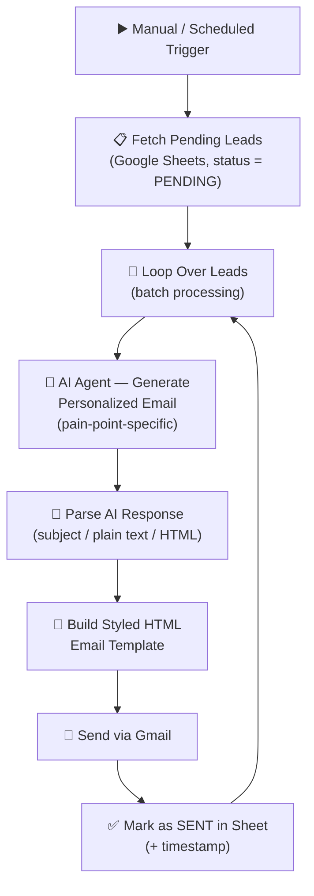

# ✉️ AI Cold Email Generator — Pain-Point-Personalized Outreach at Scale

**Feed it a sheet of leads with each one's specific pain point → get back individually written, consultative cold emails sent automatically via Gmail, with the sheet updated as it goes.**

Built with [n8n](https://n8n.io/), OpenAI, Google Sheets, and Gmail.

[](https://n8n.io/)
[]()
[]()

> 📄 This repo includes the **actual n8n workflow export** (sanitized — the real, private Google Sheet ID used during testing has been replaced with a placeholder). Import it into your own n8n instance, plug in your own leads sheet and credentials, and it's ready to run.

---

## 📌 The Problem

Most "personalized" cold email at scale isn't actually personalized — it's a template with `{{first_name}}` swapped in. Prospects can tell, and reply rates suffer for it.

Writing a *genuinely* tailored email for every lead — one that speaks to their specific pain point with a real proposed approach — doesn't scale if a human has to write each one by hand.

## 💡 The Solution

Each lead in the sheet has a specific, named pain point attached to it (not a generic industry guess — an actual identified challenge). The automation:

1. **Fetches** every lead marked `PENDING` from a Google Sheet
2. **Writes a genuinely personalized email** for each one — an AI agent acting as a senior B2B sales strategist crafts a consultative, non-salesy email that directly addresses that lead's specific pain point, with a proposed 3-phase approach (Assessment → Implementation → Optimization) and a concrete timeline
3. **Builds a polished HTML email** from the AI's output, with styled sections for the challenge, proposed solution, timeline, and benefits
4. **Sends it via Gmail**
5. **Marks the lead as `SENT`** in the sheet, with the send date logged
6. **Processes leads in batches**, with a wait between sends to stay within safe sending limits

Every email is built around that specific lead's actual challenge — not a generic template with mail-merge fields.

---

## 🏗️ Architecture



<p align="center">
  
  <br><em>n8n canvas — fetch, generate, build, send, update, loop</em>
</p>

---

## 🔄 Step-by-Step Flow

| Step | What Happens |
|---|---|
| 1. Trigger | The workflow is started (manually, or on a schedule) |
| 2. Fetch Pending Leads | Pulls every row from the Google Sheet where `Email Status` = `PENDING` |
| 3. Batch Loop | Leads are processed one batch at a time, with a wait between sends to respect Gmail's daily sending limits |
| 4. AI Email Generation | For each lead, an AI agent — primed as a senior B2B sales strategist — writes a subject line, plain-text body, and HTML body addressing that lead's specific `Pain Point`, structured around a 3-phase Assessment → Implementation → Optimization approach with a 2–3 week timeline |
| 5. Parse AI Response | The agent's JSON output is parsed into clean `subject` / `body_plain` / `body_html` fields, with error handling for malformed output |
| 6. Build HTML Template | A polished, branded HTML email is assembled — styled sections for the challenge, proposed solution, timeline, and benefits, plus a call-to-action button |
| 7. Send via Gmail | The finished email is sent to the lead |
| 8. Mark as Sent | The sheet row is updated to `SENT` with the send date, so the lead won't be emailed again on the next run |

---

## 📊 Sample Output

<p align="center">
  
  <br><em>A real email generated and sent by the automation — personalized to the lead's name, company, and specific pain point</em>
</p>

---

## 🧰 Tech Stack

| Tool | Role in the System |
|---|---|
| **n8n** | Orchestration engine — fetch, batch loop, build, send, update |
| **Google Sheets** | The lead database — source of truth for who to email and their pain point, and the sent/pending status tracker |
| **OpenAI (via n8n LangChain Agent node)** | Writes the personalized email copy for each lead |
| **Gmail** | Sends the finished email |

---

## 📋 Required Sheet Columns

| Column | Purpose |
|---|---|
| `Email Id` | Recipient's email address |
| `Name` | Recipient's name |
| `Company` | Recipient's company name |
| `Pain Point` | The specific challenge to address in the email |
| `Email Status` | `PENDING` or `SENT` — controls which leads get picked up |
| `Sent Date` | Auto-populated once the email goes out |

---

## 📁 Repo Structure

```
.
├── README.md                                  → you are here
├── docs/
│   └── WORKFLOW_OVERVIEW.md                   → detailed node-by-node breakdown
├── workflows/
│   └── Cold_Email_Pain_Point_Automation.json  → main n8n workflow (import directly into n8n)
└── assets/
    ├── workflow-canvas.png
    └── sample-email-output.png
```

---

## ⚙️ Setting It Up Yourself

1. Import `workflows/Cold_Email_Pain_Point_Automation.json` into your n8n instance
2. Create a Google Sheet with the columns listed above, and connect your **Google Sheets** credential
3. Connect a **Gmail** credential for sending
4. Connect an **OpenAI** credential for the email-generation agent
5. Update the Calendly link and signature details in the **BUILD - Create HTML Email Template** code node to your own
6. Test with a small batch first, and keep an eye on Gmail's daily sending limit (~500/day on most accounts)
7. Run via the manual trigger, or wire in a schedule trigger for fully hands-off operation

> The original export referenced a real, private Google Sheet ID, which has been replaced with a placeholder in this version. The Calendly link and email signature in the HTML template are already left as clearly marked placeholders for you to fill in.

---

## 🎯 Who This Is Built For

- Sales teams and agencies running cold outbound who want genuine per-lead personalization without writing every email by hand
- Anyone with a qualified lead list where each prospect's specific pain point is already known (from research, a discovery call, or enrichment) and wants that insight turned into outreach automatically
- A reference implementation for **AI-generated, structured-output email copy** feeding into a styled HTML template — a pattern that generalizes well beyond cold email

---

## 📬 About / Contact

Built by **VIRSpace AI** — automation systems for sales, marketing, and lead-generation operations.

- 🌐 [virspaceai.com](https://virspaceai.com/)
- 📧 viraj.bhapkar@virspaceai.com
- 📱 +91 99871 42405

> The workflow export in this repo has had its real, private Google Sheet ID replaced with a placeholder. Shared as a working reference implementation, not a hosted/managed product.
